# GitHub Actions Firmware Build Automation

This project is set up with GitHub Actions to automatically build firmware whenever code is pushed to the `main` branch.

## 🚀 How It Works

### Automatic Triggers
- **Push to main branch** - Triggers automatic build and release
- **Pull requests** - Builds and tests code (no release)
- **Manual dispatch** - Can trigger builds manually from GitHub UI

### What Happens on Push to Main
1. **Code checkout** - Full git history for versioning
2. **Environment setup** - Python 3.11 + PlatformIO
3. **Build firmware** - ESP32-C3-DevKitC-02 target
4. **Run tests** - Execute all unit tests
5. **Create release assets** - Versioned firmware files
6. **GitHub release** - Automatic release with firmware binary

## 📋 Version Management

### Version Format
The firmware uses semantic versioning with git hash:
```
1.0.0-a1b2c3d
│ │ │ └── Git hash (7 chars)
│ │ └──── Patch version
│ └────── Minor version
└──────── Major version
```

### Version Definition
Versions are defined in `src/main.cpp`:
```cpp
#define FIRMWARE_VERSION "1.0.0"
#define BOARD_MODEL "FL-LC01"
#define BOARD_DESCRIPTION "FireLabs I2C Bookshelf RGBCCT Light Controller"
```

### Bumping Versions
Use the included script to bump versions:
```bash
# Bump patch version (1.0.0 -> 1.0.1)
python3 bump_version.py patch

# Bump minor version (1.0.0 -> 1.1.0)
python3 bump_version.py minor

# Bump major version (1.0.0 -> 2.0.0)
python3 bump_version.py major
```

## 🔧 Build Process

### PlatformIO Environments
- **esp32-c3-devkitc-02** - Main ESP32 firmware build
- **native** - Unit testing environment

### Post-Build Script
The `post_build.py` script automatically:
- Extracts version info from source code
- Updates `firmware.meta` with build information
- Creates versioned firmware files
- Handles both ESP32 (.bin) and ATtiny (.hex) builds

### Build Artifacts
Each build creates:
- `firmware-v1.0.0-a1b2c3d.bin` - Versioned firmware binary
- `firmware-1.0.0-a1b2c3d.meta` - Build metadata
- `firmware.meta` - Build directory metadata

## 📁 File Structure

```
.github/
└── workflows/
    └── build-firmware.yml    # GitHub Actions workflow

src/
└── main.cpp                  # Version definitions

firmware.meta                 # Base metadata template
post_build.py                 # Post-build automation
bump_version.py               # Version bump utility
```

## 🚀 Getting Started

### 1. Push to Main
Simply push your code to the main branch:
```bash
git add .
git commit -m "Add new feature"
git push origin main
```

### 2. Monitor Build
- Check the "Actions" tab in GitHub
- Watch the build progress in real-time
- See test results and build status

### 3. Download Firmware
- Build artifacts are uploaded automatically
- GitHub releases are created for each build
- Firmware files are versioned with git hashes

## 🔍 Troubleshooting

### Build Failures
- Check the Actions tab for detailed error logs
- Ensure all dependencies are properly configured
- Verify PlatformIO configuration in `platformio.ini`

### Test Failures
- Unit tests must pass for successful builds
- Check test output for specific failures
- Fix failing tests before pushing to main

### Version Issues
- Ensure version format is X.Y.Z (e.g., "1.0.0")
- Check that version definitions are in `src/main.cpp`
- Use `bump_version.py` script for consistent versioning

## 📚 Benefits

- **Automated builds** - No manual compilation needed
- **Version tracking** - Every build has a unique version
- **Quality assurance** - Tests run automatically
- **Release management** - GitHub releases created automatically
- **Artifact storage** - Firmware files stored with builds
- **Git integration** - Versions include git commit information

## 🔄 Workflow

```mermaid
graph TD
    A[Push to Main] --> B[GitHub Actions Trigger]
    B --> C[Checkout Code]
    C --> D[Setup Environment]
    D --> E[Build Firmware]
    E --> F[Run Tests]
    F --> G[Create Release Assets]
    G --> H[Upload Artifacts]
    H --> I[Create GitHub Release]
    I --> J[🎉 Firmware Ready!]
```



This setup ensures that every push to main results in a properly versioned, tested, and released firmware build! 🚀
